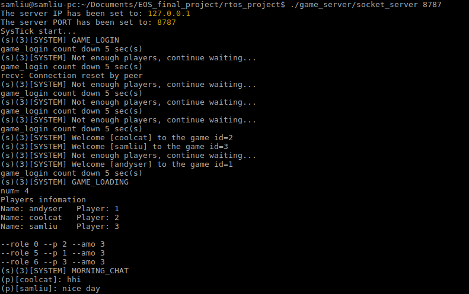
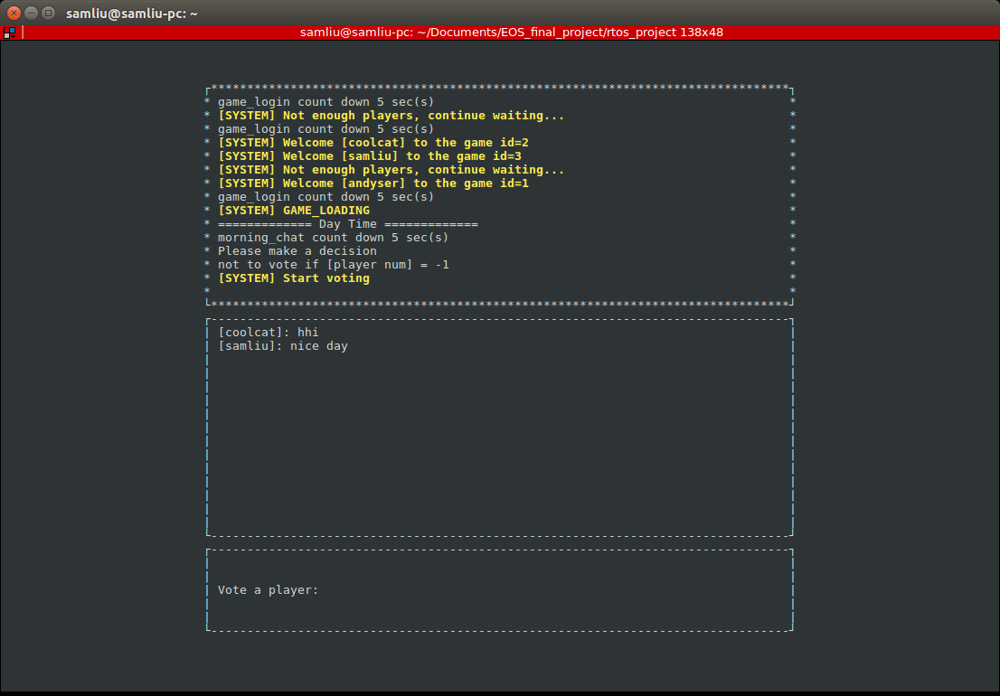

# EOS_final_project

## Requirement Platform
- Server: Creator XScale PXA270 or Other Linux system<br>
- Client: Ubuntu(16.04) PC or laptop

## How to run
Compile:
```
Server (or Client)$ cd EOS_final_project/rtos_project/
Server (or Client)$ make
```

Server:
```
PXA270$ cd EOS_final_project/rtos_project/
PXA270$ ./game_server/socket_server [IP] [PORT]
```

Client:
```
Laptop$ cd EOS_final_project/rtos_project/
Laptop$ ./socket_client [IP] [PORT]
```

## Screenshot
Server: <br>


Client: <br>
